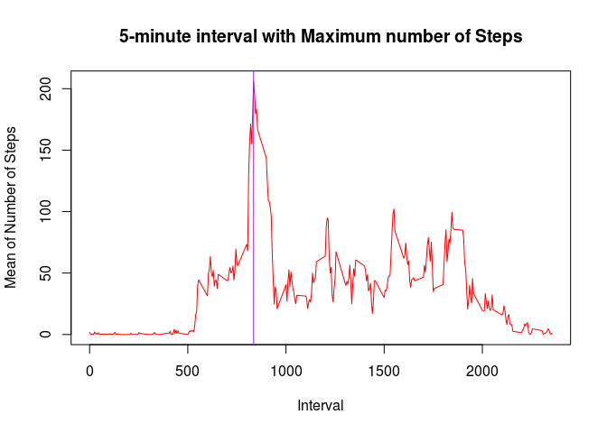
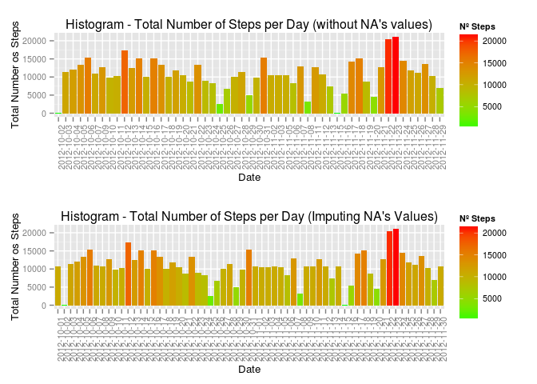
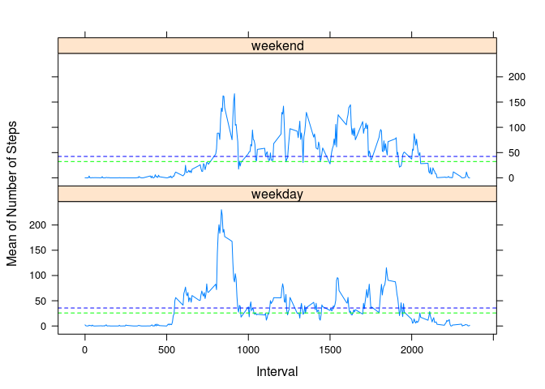

# Reproducible Research: Peer Assessment 1

---
## **Loading and preprocessing the data**
  
### 1. Unzipping "activity.zip" file and reading the CSV file


```r
data <- read.csv(unzip("activity.zip"))
head(data)
```

```
##   steps       date interval
## 1    NA 2012-10-01        0
## 2    NA 2012-10-01        5
## 3    NA 2012-10-01       10
## 4    NA 2012-10-01       15
## 5    NA 2012-10-01       20
## 6    NA 2012-10-01       25
```

  
### 2. Getting a new clean dataset without NA's values

```r
clean_data <- na.omit(data)
head(clean_data)
```

```
##     steps       date interval
## 289     0 2012-10-02        0
## 290     0 2012-10-02        5
## 291     0 2012-10-02       10
## 292     0 2012-10-02       15
## 293     0 2012-10-02       20
## 294     0 2012-10-02       25
```

NOTE: *"na.omit()"* function add row names to the *"clean_data"* dataset. This names are the numeric index where NA's were located in the original dataset *"data"*.

## **What is mean total number of steps taken per day?**


For this part of the assignment, we can ignore the missing values in the dataset, so, we use *"clean_data"* dataset.

### 1. Calculate the total number of steps taken per day


```r
suppressPackageStartupMessages(library(dplyr))
total_steps_per_day <- summarise(group_by(clean_data,date), sum(steps))
colnames(total_steps_per_day) <- c("date", "totalSteps")
head(total_steps_per_day)
```

```
## Source: local data frame [6 x 2]
## 
##         date totalSteps
## 1 2012-10-02        126
## 2 2012-10-03      11352
## 3 2012-10-04      12116
## 4 2012-10-05      13294
## 5 2012-10-06      15420
## 6 2012-10-07      11015
```


### 2. Make a histogram of the total number of steps taken each day


```r
suppressPackageStartupMessages(library(ggplot2))

p <- ggplot(total_steps_per_day, aes(x=date, y=totalSteps, fill=totalSteps))
p <- p + geom_histogram(stat='identity')
p <- p + scale_fill_gradient("Nº Steps", 
                             low = "green", 
                             high = "red")
p <- p + theme(text = element_text(size=10),axis.text.x = element_text(angle=90, vjust=1)) 
p <- p + xlab("Date")
p <- p + ylab("Total Number os Steps")
p <- p + ggtitle("Histogram - Total Number of Steps per Day")

print(p)
```

 

### 3. Calculate and report the mean and median total number of steps taken per day  


A. First we can calculate the MEAN value:

```r
mean_without_na <- mean(total_steps_per_day$totalSteps)
mean_without_na
```

```
## [1] 10766.19
```

B. And then plot the MEAN as the blue dashed line:


```r
suppressPackageStartupMessages(library(ggplot2))

p_mean <- ggplot(total_steps_per_day, aes(x=date, y=totalSteps, fill=totalSteps))
p_mean <- p_mean + geom_histogram(stat='identity')
p_mean <- p_mean + scale_fill_gradient("Nº Steps", 
                             low = "green", 
                             high = "red")
p_mean <- p_mean + theme(text = element_text(size=10),axis.text.x = element_text(angle=90, vjust=1)) 
p_mean <- p_mean + xlab("Date")
p_mean <- p_mean + ylab("Total Number os Steps")
p_mean <- p_mean + ggtitle("Histogram - MEAN of total Number of Steps per Day")
p_mean <- p_mean + geom_hline(aes(yintercept=mean(totalSteps)), 
                    color="blue", 
                    linetype="dashed", 
                    size=0.5)

# This 2 lines put the mean line in the legend or guide
 p_mean <- p_mean + geom_line(aes(color="Mean"), linetype="dashed")
 p_mean <- p_mean + scale_colour_manual(name="", values=c("Mean"= "blue"))


print(p_mean)
```

 


C. First we can calculate the MEDIAN value:

```r
median_without_na <- median(total_steps_per_day$totalSteps)
median_without_na
```

```
## [1] 10765
```

D. And then plot the MEDIAN as the green dashed line:


```r
suppressPackageStartupMessages(library(ggplot2))

p_median <- ggplot(total_steps_per_day, aes(x=date, y=totalSteps, fill=totalSteps))
p_median <- p_median + geom_histogram(stat='identity')
p_median <- p_median + scale_fill_gradient("Nº Steps", 
                             low = "green", 
                             high = "red")
 p_median <- p_median + theme(text = element_text(size=10),axis.text.x = element_text(angle=90, vjust=1)) 
p_median <- p_median + xlab("Date")
p_median <- p_median + ylab("Total Number os Steps")
p_median <- p_median + ggtitle("Histogram - MEDIAN of total Number of Steps per Day")
p_median <- p_median + geom_hline(aes(yintercept=median(totalSteps)), 
                    color="green", 
                    linetype="dashed", 
                    size=0.5) 

# This 2 lines put the mean line in the legend or guide
 p_median <- p_median + geom_line(aes(color="Median"), linetype="dashed")
 p_median <- p_median + scale_colour_manual(name="", values=c("Median"= "green"))

print(p_median)
```

 

NOTE: We use two different plots because the mean and median values are very similar. In this way, we can see the lines more clearly.

## **What is the average daily activity pattern?**
     
### 1. Make a time series plot (i.e. type = "l") of the 5-minute interval (x-axis) and the average number of steps taken, averaged across all days (y-axis)  

We need to group the data by interval, and then calculate the mean of steps values.


```r
mean_steps_per_interval <- summarise(group_by(clean_data,interval), mean(steps))
colnames(mean_steps_per_interval) <- c("interval","meanSteps")
head(mean_steps_per_interval)
```

```
## Source: local data frame [6 x 2]
## 
##   interval meanSteps
## 1        0 1.7169811
## 2        5 0.3396226
## 3       10 0.1320755
## 4       15 0.1509434
## 5       20 0.0754717
## 6       25 2.0943396
```


In this case we are going to use the base plot system.


```r
plot(mean_steps_per_interval$interval, 
     y = mean_steps_per_interval$meanSteps, 
     type = "l",
     col = "red",
     main = "Time Series Plot - Avg. of Steps per Interval",
     xlab = "Interval",
     ylab = "Mean of Number of Steps")
```

 

### 2. Which 5-minute interval, on average across all the days in the dataset, contains the maximum number of steps?

We are going to calculate the MAX value of meanSteps column:


```r
max_interval_value_df <- subset(mean_steps_per_interval,  meanSteps == max(meanSteps))

# print the dataframe
max_interval_value_df
```

```
## Source: local data frame [1 x 2]
## 
##   interval meanSteps
## 1      835  206.1698
```

The 5-minute interval **835**, contains the maximum number of steps.


```r
plot(mean_steps_per_interval$interval, 
     y = mean_steps_per_interval$meanSteps, 
     type = "l",
     col = "red",
     main = "5-minute interval with Maximum number of Steps",
     xlab = "Interval",
     ylab = "Mean of Number of Steps")
        
    abline(v=max_interval_value_df$interval, col="purple", )
```

 

## **Imputing missing values**

### 1. Calculate and report the total number of missing values in the dataset (i.e. the total number of rows with NAs)


```r
sum(is.na(data$steps))
```

```
## [1] 2304
```

The total number of missing values in the dataset is **2304**.   


### 2. Devise a strategy for filling in all of the missing values in the dataset

**The strategy:** for filling in all of the missing values in the dataset, we want to use the **mean value for each interval**. I think using tne mean of each day is not possible, because there are full days with no values (ie: the first day in dataset).    

So, we need to make a copy of the original dataset. In this new dataset, we will add a **new column with the mean for each interval.**. For this purpouse we use *ave()* function. This function Group Averages Over Level Combinations of Factors (and much more, see ?ave in R).

### 3. Create a new dataset that is equal to the original dataset but with the missing data filled in


```r
## copy the original dataset into a new dataset
data_copy <- data

## Add a new column *mean_Steps_Per_Interval* with the mean for each interval: function "ave()" does that work.
data_copy$mean_Steps_Per_Interval <- ave(data_copy$steps, 
                                         data_copy$interval, 
                                         FUN = function(x) mean(x, na.rm = T))

head(data_copy)
```

```
##   steps       date interval mean_Steps_Per_Interval
## 1    NA 2012-10-01        0               1.7169811
## 2    NA 2012-10-01        5               0.3396226
## 3    NA 2012-10-01       10               0.1320755
## 4    NA 2012-10-01       15               0.1509434
## 5    NA 2012-10-01       20               0.0754717
## 6    NA 2012-10-01       25               2.0943396
```

Now, we can replace the steps column with NA's values, with the corresponding *mean_Steps_Per_Interval* column values in *data_copy* dataset.


```r
data_copy <- mutate(data_copy, steps = replace(data_copy$steps, 
                                               is.na(data_copy$steps), 
                                               data_copy$mean_Steps_Per_Interval))
head(data_copy)
```

```
##       steps       date interval mean_Steps_Per_Interval
## 1 1.7169811 2012-10-01        0               1.7169811
## 2 0.3396226 2012-10-01        5               0.3396226
## 3 0.1320755 2012-10-01       10               0.1320755
## 4 0.1509434 2012-10-01       15               0.1509434
## 5 0.0754717 2012-10-01       20               0.0754717
## 6 2.0943396 2012-10-01       25               2.0943396
```


### 4. Make a histogram of the total number of steps taken each day and Calculate and report the mean and median total number of steps taken per day. Do these values differ from the estimates from the first part of the assignment? What is the impact of imputing missing data on the estimates of the total daily number of steps?

4.A - Make a histogram of the total number of steps taken each day and Calculate and report the mean and median total number of steps taken per day.

First, we calculate the new dataset for total steps per day, using the new data *data_copy*, without NA's values.


```r
total_steps_per_day2 <- summarise(group_by(data_copy,date), sum(steps))
colnames(total_steps_per_day2) <- c("date", "totalSteps")
head(total_steps_per_day2)
```

```
## Source: local data frame [6 x 2]
## 
##         date totalSteps
## 1 2012-10-01   10766.19
## 2 2012-10-02     126.00
## 3 2012-10-03   11352.00
## 4 2012-10-04   12116.00
## 5 2012-10-05   13294.00
## 6 2012-10-06   15420.00
```


In this case, we want to compare the **original histogram without NA's values** with the new histogram with **imputing missing values**.


```r
suppressPackageStartupMessages(library(ggplot2))

## Load this script for multple plotting with ggplot2.
## this script is available in my github repository for this assignment
source("multiplot.R")

# override the main title in the original plot
p <- p + ggtitle("Histogram - Total Number of Steps per Day (without NA's values)")

# Create a second plot for the new dataset with imputing missing values
p2 <- ggplot(total_steps_per_day2, aes(x=date, y=totalSteps, fill=totalSteps))
p2 <- p2 + geom_histogram(stat='identity')
p2 <- p2 + scale_fill_gradient("Nº Steps", 
                             low = "green", 
                             high = "red")
p2 <- p2 + theme(text = element_text(size=10),axis.text.x = element_text(angle=90, vjust=1)) 
p2 <- p2 + xlab("Date")
p2 <- p2 + ylab("Total Number os Steps")
p2 <- p2 + ggtitle("Histogram - Total Number of Steps per Day (Imputing NA's Values)")

## Call to multipot function for plotting the 2 plots in one column
multiplot(p, p2, cols = 1)
```

 


4.B - Calculate and report the mean and median total number of steps taken per day. Do these values differ from the estimates from the first part of the assignment?

First we can calculate the NEW MEAN:

```r
mean_imputing_na <- mean(total_steps_per_day2$totalSteps)
mean_imputing_na
```

```
## [1] 10766.19
```

The old MEAN was:

```r
mean_without_na
```

```
## [1] 10766.19
```

The NEW MEDIAN is:

```r
median_imputing_na <- median(total_steps_per_day2$totalSteps)
median_imputing_na
```

```
## [1] 10766.19
```

The old MEDIAN was:

```r
median_without_na
```

```
## [1] 10765
```


 * FIRST MEAN is identical to the NEW MEAN obtained with imputing NA's values.
 * FIRST MEDIAN is almost the same that NEW MEDIAN obtained with imputing NA's values. In this case the MEDIAN and MEAN are identical.
 
 
4.C - What is the impact of imputing missing data on the estimates of the total daily number of steps?
 
 * IN THIS CASE, the impact of imputing missing data is minimal.


## **Are there differences in activity patterns between weekdays and weekends?**

### 1. Create a new factor variable in the dataset with two levels – “weekday” and “weekend” indicating whether a given date is a weekday or weekend day. Use the dataset with the filled-in missing values for this part.


```r
## I need to change my LOCALE (spanish) to English...so, daynames are in english
Sys.setlocale('LC_TIME', 'en_US.UTF-8')
```

```
## [1] "en_US.UTF-8"
```

```r
## Create a new factor variable in the dataset with two levels – “weekday” and “weekend” indicating whether a given date is a weekday or weekend day
data_copy$day_type <- as.factor(ifelse(weekdays(as.Date(data_copy$date)) %in% 
                                        c('Saturday','Sunday'), "weekend","weekday" ))

## show the dataset
head(data_copy)
```

```
##       steps       date interval mean_Steps_Per_Interval day_type
## 1 1.7169811 2012-10-01        0               1.7169811  weekday
## 2 0.3396226 2012-10-01        5               0.3396226  weekday
## 3 0.1320755 2012-10-01       10               0.1320755  weekday
## 4 0.1509434 2012-10-01       15               0.1509434  weekday
## 5 0.0754717 2012-10-01       20               0.0754717  weekday
## 6 2.0943396 2012-10-01       25               2.0943396  weekday
```

```r
# revert the LOCALE to es_ES for showing week Days in spanish
Sys.setlocale('LC_TIME', 'es_ES.UTF-8')
```

```
## [1] "es_ES.UTF-8"
```

### 2. Make a panel plot containing a time series plot (i.e. type = "l") of the 5-minute interval (x-axis) and the average number of steps taken, averaged across all weekday days or weekend days (y-axis).


```r
# create a new dataset with the average number of steps taken
mean_steps_per_interval2 <- summarise(group_by(data_copy,interval, day_type), mean(steps))

## correct the column names (mean(steps) --> meanSteps)
colnames(mean_steps_per_interval2) <- c("interval", "day_type","meanSteps")

# Show the dataset
head(mean_steps_per_interval2)
```

```
## Source: local data frame [6 x 3]
## Groups: interval
## 
##   interval day_type  meanSteps
## 1        0  weekday 2.25115304
## 2        0  weekend 0.21462264
## 3        5  weekday 0.44528302
## 4        5  weekend 0.04245283
## 5       10  weekday 0.17316562
## 6       10  weekend 0.01650943
```

Now, we can plot 2 panels, one for weekend and other for weekdays. In this case, we are going to use the *lattice* graphics package.


```r
library(lattice)

xyplot(meanSteps ~ interval | day_type, 
        data = mean_steps_per_interval2,  
        panel = function(x, y, ...) {
               panel.xyplot(x, y, ...)
               panel.abline(h = mean(y), lty=2,col="blue", ...)
               panel.abline(h = median(y), lty=2,col="green", ...)
             },      
        type = "l",
        xlab = "Interval",
        ylab = "Mean of Number of Steps",
        layout=c(1,2))
```

 

The blue line is the Mean, and the green line is the Median values.

Now we can analyze separately several values for weekend days and weekday days.


```r
## subsetting weekend days
weekend_days <- subset(mean_steps_per_interval2, mean_steps_per_interval2$day_type == "weekend")

## subsetting weekday days
weekday_days <- subset(mean_steps_per_interval2, mean_steps_per_interval2$day_type == "weekday")

# print a summary of meanSteps values
summary(weekend_days$meanSteps)
```

```
##    Min. 1st Qu.  Median    Mean 3rd Qu.    Max. 
##   0.000   1.241  32.340  42.370  74.650 166.600
```

```r
summary(weekday_days$meanSteps)
```

```
##    Min. 1st Qu.  Median    Mean 3rd Qu.    Max. 
##   0.000   2.247  25.800  35.610  50.850 230.400
```

In general, there are more activity in weekend days, though the interval maximum activity is given in weekdays (205.400). The mean and median values are higher in weekend days than weekday days.

    
      
            
