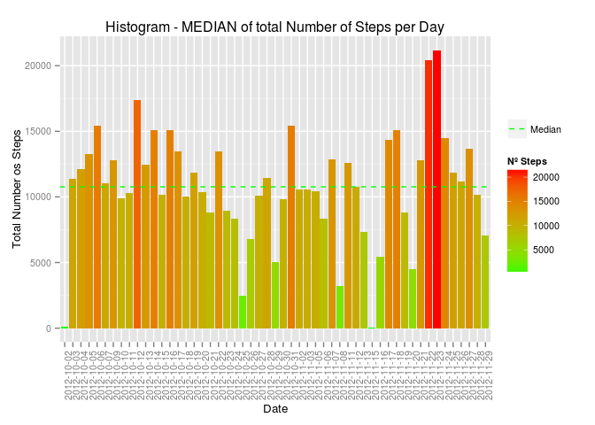

# Reproducible Research: Peer Assessment 1

---
## **Loading and preprocessing the data**
  
### 1. Unzipping "activity.zip" file and reading the CSV file


```r
data <- read.csv(unzip("activity.zip"))
head(data)
```

```
##   steps       date interval
## 1    NA 2012-10-01        0
## 2    NA 2012-10-01        5
## 3    NA 2012-10-01       10
## 4    NA 2012-10-01       15
## 5    NA 2012-10-01       20
## 6    NA 2012-10-01       25
```

  
### 2. Getting a new clean dataset without NA's values

```r
clean_data <- na.omit(data)
head(clean_data)
```

```
##     steps       date interval
## 289     0 2012-10-02        0
## 290     0 2012-10-02        5
## 291     0 2012-10-02       10
## 292     0 2012-10-02       15
## 293     0 2012-10-02       20
## 294     0 2012-10-02       25
```

NOTE: *"na.omit()"* function add row names to the *"clean_data"* dataset. This names are the numeric index where NA's were located in the original dataset *"data"*.

## **What is mean total number of steps taken per day?**


For this part of the assignment, we can ignore the missing values in the dataset, so, we use *"clean_data"* dataset.

### 1. Calculate the total number of steps taken per day


```r
suppressPackageStartupMessages(library(dplyr))
total_steps_per_day <- summarise(group_by(clean_data,date), sum(steps))
colnames(total_steps_per_day) <- c("date", "totalSteps")
head(total_steps_per_day)
```

```
## Source: local data frame [6 x 2]
## 
##         date totalSteps
## 1 2012-10-02        126
## 2 2012-10-03      11352
## 3 2012-10-04      12116
## 4 2012-10-05      13294
## 5 2012-10-06      15420
## 6 2012-10-07      11015
```


### 2. Make a histogram of the total number of steps taken each day


```r
suppressPackageStartupMessages(library(ggplot2))

p <- ggplot(total_steps_per_day, aes(x=date, y=totalSteps, fill=totalSteps))
p <- p + geom_histogram(stat='identity')
p <- p + scale_fill_gradient("Nº Steps", 
                             low = "green", 
                             high = "red")
p <- p + theme(text = element_text(size=10),axis.text.x = element_text(angle=90, vjust=1)) 
p <- p + xlab("Date")
p <- p + ylab("Total Number os Steps")
p <- p + ggtitle("Histogram - Total Number of Steps per Day")

print(p)
```

 

### 3. Calculate and report the mean and median total number of steps taken per day  


A. First we can calculate the MEAN value:

```r
mean(total_steps_per_day$totalSteps)
```

```
## [1] 10766.19
```

B. And then plot the MEAN as the blue dashed line:


```r
suppressPackageStartupMessages(library(ggplot2))

p <- ggplot(total_steps_per_day, aes(x=date, y=totalSteps, fill=totalSteps))
p <- p + geom_histogram(stat='identity')
p <- p + scale_fill_gradient("Nº Steps", 
                             low = "green", 
                             high = "red")
p <- p + theme(text = element_text(size=10),axis.text.x = element_text(angle=90, vjust=1)) 
p <- p + xlab("Date")
p <- p + ylab("Total Number os Steps")
p <- p + ggtitle("Histogram - MEAN of total Number of Steps per Day")
p <- p + geom_hline(aes(yintercept=mean(totalSteps)), 
                    color="blue", 
                    linetype="dashed", 
                    size=0.5,
                    show_guide = TRUE) # "show_guide" is needed to show in legend 

# This 2 lines put the mean line in the legend or guide
 p <- p + geom_line(aes(color="Mean"), linetype="dashed")
 p <- p + scale_colour_manual(name="", values=c("Mean"= "blue"))


print(p)
```

 


C. First we can calculate the MEDIAN value:

```r
median(total_steps_per_day$totalSteps)
```

```
## [1] 10765
```

D. And then plot the MEDIAN as the green dashed line:


```r
suppressPackageStartupMessages(library(ggplot2))

p <- ggplot(total_steps_per_day, aes(x=date, y=totalSteps, fill=totalSteps))
p <- p + geom_histogram(stat='identity')
p <- p + scale_fill_gradient("Nº Steps", 
                             low = "green", 
                             high = "red")
p <- p + theme(text = element_text(size=10),axis.text.x = element_text(angle=90, vjust=1)) 
p <- p + xlab("Date")
p <- p + ylab("Total Number os Steps")
p <- p + ggtitle("Histogram - MEDIAN of total Number of Steps per Day")
p <- p + geom_hline(aes(yintercept=mean(totalSteps)), 
                    color="green", 
                    linetype="dashed", 
                    size=0.5,
                    show_guide = TRUE) # "show_guide" is needed to show in legend

# This 2 lines put the mean line in the legend or guide
 p <- p + geom_line(aes(color="Median"), linetype="dashed")
 p <- p + scale_colour_manual(name="", values=c("Median"= "green"))

print(p)
```

 

NOTE: We use two different plots because the mean and median values are very similar. In this way, we can see the lines more clearly.

## **What is the average daily activity pattern?**
     
### 1. Make a time series plot (i.e. type = "l") of the 5-minute interval (x-axis) and the average number of steps taken, averaged across all days (y-axis)  


```r
mean_steps_per_interval <- summarise(group_by(clean_data,interval), mean(steps))
colnames(mean_steps_per_interval) <- c("interval","meanSteps")
head(mean_steps_per_interval)
```

```
## Source: local data frame [6 x 2]
## 
##   interval meanSteps
## 1        0 1.7169811
## 2        5 0.3396226
## 3       10 0.1320755
## 4       15 0.1509434
## 5       20 0.0754717
## 6       25 2.0943396
```


```r
plot(mean_steps_per_interval$interval, y = mean_steps_per_interval$meanSteps, type = "l")
```

 

## Imputing missing values


## Are there differences in activity patterns between weekdays and weekends?
